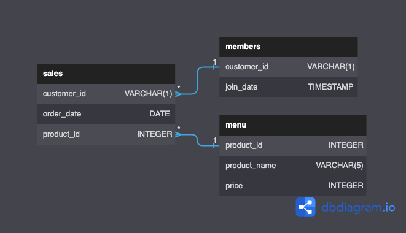

# Case Study #1 - Danny's Diner

    

 

---

**Note:** *If you want to join this challenge, please see more details about this case study on [Danny's Diner (Case Study #1)](https://8weeksqlchallenge.com/case-study-1/).*

*You can also find my chellenge story on [Medium](https://medium.com/@thanakorn.tha/8-week-sql-challenge-dannys-diner-case-study-1-b4ff39d22139) and my SQL queries for this case study on this [GitHub repository](https://github.com/thanakorntha/8-week-sql-challenge/tree/main/1-danny-diner/codes).*

---

 

## Introduction

Danny is a passionate entrepreneur who opened a Japanese restaurant called Danny's Diner in 2021, selling only his 3 favourite foods such as:

* Sushi  🍣
* Curry  🍛 
* Ramen  🍜

He has been collecting basic data about his customers, such as their visiting patterns, spending habits, and favorite menu items. Danny wants to use this data to **improve his business and make smarter decisions about his customer loyalty program**. 

He has provided a sample of his customer data, and he hopes that you can use it to write SQL queries that will help him answer his questions.

 

## Datasets

Danny has shared 3 key datasets in the `dannys_diner` database schema: 

* **`sales`** = captures all `customer_id` level purchases with an corresponding `order_date` and `product_id` information for when and what menu items were ordered
* **`menu`** = maps the `product_id` to the actual `product_name` and `price` of each menu item
* **`members`** = captures the `join_date` when a `customer_id` joined the beta version of the Danny’s Diner loyalty program

You can see the relationship between 3 tables for this case study below:

 

    

 

You can also find more details about datasets [here](https://8weeksqlchallenge.com/case-study-1/).

 

## Case Study Questions

Danny has provided me with 10 questions that he needs to be answered:

1. What is the total amount each customer spent at the restaurant?
2. How many days has each customer visited the restaurant?
3. What was the first item from the menu purchased by each customer?
4. What is the most purchased item on the menu and how many times was it purchased by all customers?
5. Which item was the most popular for each customer?
6. Which item was purchased first by the customer after they became a member?
7. Which item was purchased just before the customer became a member?
8. What are the total items and amount spent for each member before they became a member?
9.  If each $1 spent equates to 10 points and sushi has a 2x points multiplier - how many points would each customer have?
10. In the first week after a customer joins the program (including their join date) they earn 2x points on all items, not just sushi - how many points do customer A and customer B have at the end of January?

 

## SQL Topics Covered

Here are the SQL topics that you can learn and practice in this case study:

* **Common Table Expressions (CTEs)** allow you to define a temporary table that can be used in the body of a query
* **Group By Aggregates** allows you to group rows together and calculate summary statistics for each group, including COUNT(), SUM(), AVG(), MAX(), and MIN()
* **Window Functions for Ranking** allow you to calculate values over a window of rows that can be used to rank rows, calculate moving averages, and identify outliers
* **Table Joins** allow you to combine data from two or more tables: inner joins, outer joins, and self joins

---

[Back to Top](#case-study-1---dannys-diner)