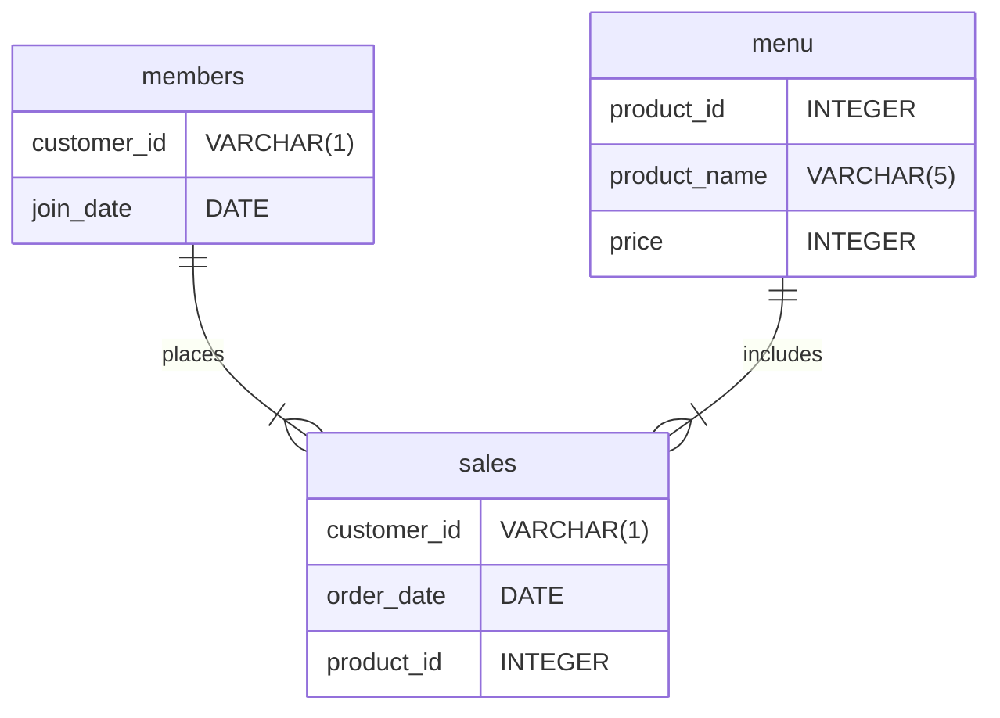

Case Study #1 - Danny's Diner
==================================================

<br>
<p align="center">
    
</p>
<p align="center">
    <i>
        <b>NOTE:</b> All information for this case study can be found 
        on the <a href="https://8weeksqlchallenge.com/case-study-1/">8-Week SQL Challenge</a> 
        by <a href="https://www.linkedin.com/in/datawithdanny/">Danny Ma</a>.
    </i>
</p>
<br>


Table of Contents
--------------------------------------------------

- [Introduction and Problem Statement](#introduction-and-problem-statement)
- [Available Data](#available-data)
- [Entity-Relationship Diagram](#entity-relationship-diagram)
- [Case Study Questions and Answers](#case-study-questions-and-answers)
    - [Data Analysis Questions](#a-data-analysis-questions)
    - [Bonus Questions](#b-bonus-questions)

<br>


Introduction and Problem Statement
--------------------------------------------------

Danny is a passionate entrepreneur, openning Japanese restaurant since 2021, selling only his 3 favourite foods such as:

- 🍣 Sushi
- 🍛 Curry 
- 🍜 Ramen

He has been collecting basic data about his customers, such as their visiting patterns, spending habits, and favorite menu items. He wants to use this data to **improve his business and make smarter decisions about his customer loyalty program**. He has provided a sample of his customer data, and he hopes that you can use it to write SQL queries that will help him answer his questions.

<br>


Available Data
--------------------------------------------------

Danny has shared 3 key tables of the `dannys_diner` database schema for you to explore:

- `sales`
- `menu`
- `members`

For more information and example of the data, please check out the link [here](https://8weeksqlchallenge.com/case-study-1/)

<br>


Entity-Relationship Diagram
--------------------------------------------------

Based on the data above, the entity-relationship diagram for Danny's Diner can be drawn as follows:



<br>


Case Study Questions and Answers
--------------------------------------------------

### A. Data Analysis Questions

#### 1. What is the total amount each customer spent at the restaurant?

``` sql
SELECT 
    customer_id, 
    SUM(price) AS total_price
FROM dannys_diner.sales AS s
INNER JOIN dannys_diner.menu AS m ON s.product_id = m.product_id
GROUP BY customer_id;
```

| customer_id | total_price |
|-------------|-------------|
| B           | 74          |
| C           | 36          |
| A           | 76          |


#### 2. How many days has each customer visited the restaurant?

``` sql
SELECT 
    customer_id, 
    COUNT(DISTINCT(order_date)) AS visit_count
FROM dannys_diner.sales
GROUP BY customer_id;
```

| customer_id | visit_count |
|-------------|-------------|
| A           | 4           |
| B           | 6           |
| C           | 2           |


#### 3. What was the first item from the menu purchased by each customer?

``` sql
WITH item_purchase_rank AS (
    SELECT 
        customer_id,
        order_date, 
        product_name, 
        RANK() OVER (PARTITION BY customer_id ORDER BY order_date) AS item_rank
    FROM dannys_diner.sales AS s
    INNER JOIN dannys_diner.menu AS m ON s.product_id = m.product_id
)
SELECT 
    customer_id, 
    product_name
FROM item_purchase_rank
WHERE item_rank = 1
GROUP BY customer_id, product_name;
```

| "customer_id" | "product_name" |
|---------------|----------------|
| "A"           | "curry"        |
| "A"           | "sushi"        |
| "B"           | "curry"        |
| "C"           | "ramen"        |


#### 4. What is the most purchased item on the menu and how many times was it purchased by all customers?

``` sql
SELECT 
    product_name, 
    COUNT(product_name) AS item_count
FROM dannys_diner.sales AS s
JOIN dannys_diner.menu AS m ON s.product_id = m.product_id
GROUP BY product_name
ORDER BY item_count DESC
LIMIT 1;
```

| product_name | item_count |
|--------------|------------|
| ramen        | 8          |


#### 5. Which item was the most popular for each customer?

``` sql
WITH popular_item_rank AS (
    SELECT 
        customer_id,
        product_name, 
        COUNT(product_name) AS item_count,
        RANK() OVER (PARTITION BY customer_id ORDER BY COUNT(customer_id) DESC) AS item_rank
    FROM dannys_diner.sales AS s
    INNER JOIN dannys_diner.menu AS m ON s.product_id = m.product_id
    GROUP BY customer_id, product_name
)
SELECT 
    customer_id, 
    product_name,
    item_count
FROM popular_item_rank
WHERE item_rank = 1;
```

| customer_id | product_name | item_count |
|-------------|--------------|------------|
| A           | ramen        | 3          |
| B           | sushi        | 2          |
| B           | curry        | 2          |
| B           | ramen        | 2          |
| C           | ramen        | 3          |


#### 6. Which item was purchased first by the customer after they became a member?

``` sql
WITH member_purchase_after AS (
    SELECT 
        s.customer_id,
        join_date,
        order_date,
        product_id,
        RANK() OVER (PARTITION BY s.customer_id ORDER BY order_date) AS item_rank
    FROM dannys_diner.sales AS s
    INNER JOIN dannys_diner.members AS m ON s.customer_id = m.customer_id
    WHERE order_date >= join_date
)
SELECT 
    customer_id, 
    join_date, 
    order_date, 
    product_name
FROM member_purchase_after AS mpa
INNER JOIN dannys_diner.menu AS m2 ON mpa.product_id = m2.product_id
WHERE item_rank = 1
ORDER BY customer_id;
```

| customer_id | join_date  | order_date | product_name |
|-------------|------------|------------|--------------|
| A           | 2021-01-07 | 2021-01-07 | curry        |
| B           | 2021-01-09 | 2021-01-11 | sushi        |


#### 7. Which item was purchased just before the customer became a member?

``` sql
WITH member_purchase_before AS (
    SELECT 
        s.customer_id,
        join_date,
        order_date,
        product_id,
        RANK() OVER (PARTITION BY s.customer_id ORDER BY order_date DESC) AS item_rank
    FROM dannys_diner.sales AS s
    INNER JOIN dannys_diner.members AS m ON s.customer_id = m.customer_id
    WHERE order_date < join_date
)
SELECT 
    customer_id, 
    join_date, 
    order_date, 
    product_name
FROM member_purchase_before AS mpb
INNER JOIN dannys_diner.menu AS m2 ON mpb.product_id = m2.product_id
WHERE item_rank = 1
ORDER BY customer_id;
```

| customer_id | join_date  | order_date | product_name |
|-------------|------------|------------|--------------|
| A           | 2021-01-07 | 2021-01-01 | sushi        |
| A           | 2021-01-07 | 2021-01-01 | curry        |
| B           | 2021-01-09 | 2021-01-04 | sushi        |


#### 8. What are the total items and amount spent for each member before they became a member?

``` sql
SELECT 
    s.customer_id, 
    COUNT(product_name) AS total_item,
    SUM(price) AS total_price
FROM dannys_diner.sales AS s
INNER JOIN dannys_diner.menu AS m ON s.product_id = m.product_id
INNER JOIN dannys_diner.members AS m2 ON s.customer_id = m2.customer_id
WHERE order_date < join_date
GROUP BY s.customer_id
ORDER BY s.customer_id;
```

| customer_id | total_item | total_price |
|-------------|------------|-------------|
| A           | 2          | 25          |
| B           | 3          | 40          |


#### 9. If each $1 spent equates to 10 points and sushi has a 2x points multiplier - how many points would each customer have?

``` sql
WITH menu_point AS (
    SELECT 
        product_id, 
        product_name, 
        price,
        CASE 
            WHEN product_id = 1 THEN (price * 10) * 2 
            ELSE price * 10 
        END AS menu_point
    FROM dannys_diner.menu
)
SELECT 
    s.customer_id,
    SUM(menu_point) AS total_point
FROM dannys_diner.sales AS s
INNER JOIN menu_point AS mp ON s.product_id = mp.product_id
GROUP BY s.customer_id
ORDER BY s.customer_id;
```

| customer_id | total_point |
|-------------|-------------|
| A           | 860         |
| B           | 940         |
| C           | 360         |


#### 10. In the first week after a customer joins the program (including their join date) they earn 2x points on all items, not just sushi - how many points do customer A and customer B have at the end of January?

``` sql
WITH is_member AS (
    SELECT 
        s.customer_id,
        join_date,
        order_date,
        s.product_id, 
        product_name, 
        price, 
        CASE 
            WHEN (join_date <= order_date) AND ((join_date + INTERVAL '6 DAY') >= order_date) THEN 'Y'
            ELSE 'N'
        END AS is_member
    FROM dannys_diner.sales AS s
    INNER JOIN dannys_diner.menu AS m ON s.product_id = m.product_id
    INNER JOIN dannys_diner.members AS m2 ON s.customer_id = m2.customer_id
    ORDER BY s.customer_id, order_date
)
SELECT
    customer_id,
    SUM(
        CASE 
            WHEN is_member = 'Y' THEN (price * 10) * 2
            WHEN is_member = 'N' AND product_id = 1 THEN (price * 10) * 2
            ELSE price * 10
        END
    ) AS total_point
FROM is_member
WHERE order_date <= '2021-01-31'
GROUP BY customer_id
ORDER BY customer_id;
```

| customer_id | total_point |
|-------------|-------------|
| A           | 1370        |
| B           | 820         |


### B. Bonus Questions

#### 1. Join All the Things

Recreate the following table output using the available data:

| customer_id | order_date | product_name | price | member |
|-------------|------------|--------------|-------|--------|
| A           | 2021-01-01 | curry        | 15    | N      |
| A           | 2021-01-01 | sushi        | 10    | N      |
| A           | 2021-01-07 | curry        | 15    | Y      |
| A           | 2021-01-10 | ramen        | 12    | Y      |
| A           | 2021-01-11 | ramen        | 12    | Y      |
| A           | 2021-01-11 | ramen        | 12    | Y      |
| B           | 2021-01-01 | curry        | 15    | N      |
| B           | 2021-01-02 | curry        | 15    | N      |
| B           | 2021-01-04 | sushi        | 10    | N      |
| B           | 2021-01-11 | sushi        | 10    | Y      |
| B           | 2021-01-16 | ramen        | 12    | Y      |
| B           | 2021-02-01 | ramen        | 12    | Y      |
| C           | 2021-01-01 | ramen        | 12    | N      |
| C           | 2021-01-01 | ramen        | 12    | N      |
| C           | 2021-01-07 | ramen        | 12    | N      |

``` sql
SELECT 
    s.customer_id, 
    order_date, 
    product_name, 
    price, 
    CASE 
        WHEN order_date >= join_date THEN 'Y' 
        ELSE 'N'
    END AS member
FROM dannys_diner.sales AS s
LEFT JOIN dannys_diner.menu AS m ON s.product_id = m.product_id
LEFT JOIN dannys_diner.members AS m2 ON s.customer_id = m2.customer_id;
``` 

#### 2. Rank All the Things

Danny also requires further information about the `ranking` of customer products, but he purposely does not need the ranking for non-member purchases so he expects null `ranking` values for the records when customers are not yet part of the loyalty program.

| customer_id | order_date | product_name | price | member | ranking |
|-------------|------------|--------------|-------|--------|---------|
| A           | 2021-01-01 | curry        | 15    | N      | null    |
| A           | 2021-01-01 | sushi        | 10    | N      | null    |
| A           | 2021-01-07 | curry        | 15    | Y      | 1       |
| A           | 2021-01-10 | ramen        | 12    | Y      | 2       |
| A           | 2021-01-11 | ramen        | 12    | Y      | 3       |
| A           | 2021-01-11 | ramen        | 12    | Y      | 3       |
| B           | 2021-01-01 | curry        | 15    | N      | null    |
| B           | 2021-01-02 | curry        | 15    | N      | null    |
| B           | 2021-01-04 | sushi        | 10    | N      | null    |
| B           | 2021-01-11 | sushi        | 10    | Y      | 1       |
| B           | 2021-01-16 | ramen        | 12    | Y      | 2       |
| B           | 2021-02-01 | ramen        | 12    | Y      | 3       |
| C           | 2021-01-01 | ramen        | 12    | N      | null    |
| C           | 2021-01-01 | ramen        | 12    | N      | null    |
| C           | 2021-01-07 | ramen        | 12    | N      | null    |

``` sql
WITH is_member AS (
SELECT 
    s.customer_id, 
    order_date, 
    product_name, 
    price, 
    CASE 
        WHEN order_date >= join_date THEN 'Y' 
        ELSE 'N'
    END AS member
FROM dannys_diner.sales AS s
LEFT JOIN dannys_diner.menu AS m ON s.product_id = m.product_id
LEFT JOIN dannys_diner.members AS m2 ON s.customer_id = m2.customer_id
)
SELECT 
    customer_id, 
    order_date, 
    product_name, 
    price,
    CASE 
        WHEN member = 'N' THEN NULL 
        ELSE RANK() OVER(PARTITION BY customer_id, member ORDER BY order_date) 
    END AS ranking
FROM is_member;
```
