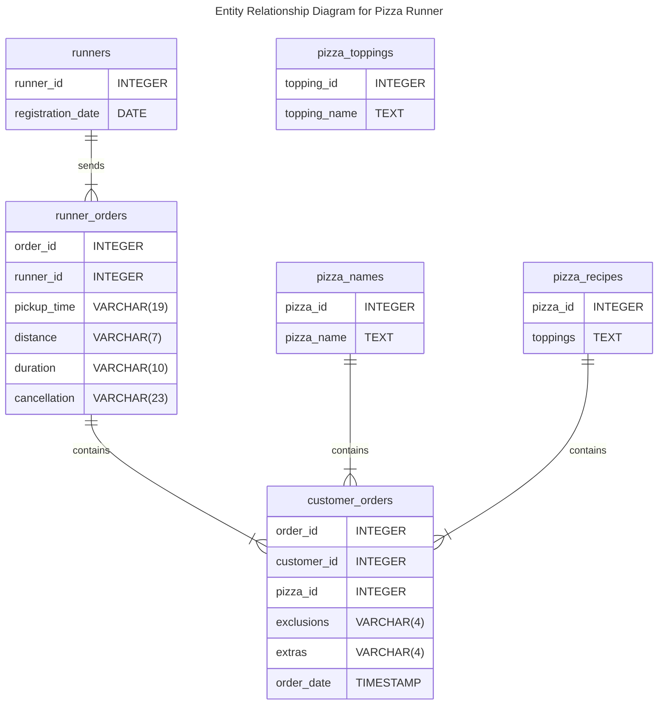

Case Study #2 - Pizza Runner
==================================================

<br>
<p align="center">
    
</p>
<p align="center">
    <i>
        <b>NOTE:</b> All information for this case study can be found 
        on the <a href="https://8weeksqlchallenge.com/case-study-2/">8-Week SQL Challenge</a> 
        by <a href="https://www.linkedin.com/in/datawithdanny/">Danny Ma</a>.
    </i>
</p>
<br>


Table of Contents
--------------------------------------------------

- [Introduction and Problem Statement](#introduction-and-problem-statement)
- [Available Data](#available-data)
- [Entity-Relationship Diagram](#entity-relationship-diagram)
- [Case Study Questions and Answers](#case-study-questions-and-answers)
    - [A. Customer Journey](#a-customer-journey)
    - [B. Data Analysis Questions](#b-data-analysis-questions)

<br>


Introduction and Problem Statement
--------------------------------------------------

Did you know that over 115 million kilograms of pizza are consumed around the world every single day? (Thanks, Wikipedia!)

For Danny, this global obsession with pizza sparked an idea as he scrolled through Instagram and spotted a post that read, “80s Retro Styling and Pizza Is The Future!” Instantly hooked, Danny had a vision. He knew that pizza alone might not be enough to grab investors’ attention&mdash;so he decided to add a tech twist and "Uberize" the concept. And with that, Pizza Runner was born.

Danny got to work, recruiting “runners” to deliver fresh pizzas right from Pizza Runner Headquarters (a.k.a. his own living room). To turn his vision into reality, he maxed out his credit card to hire freelance developers and launched a mobile app where customers could order with a tap. His mission? To build a pizza empire with retro flair and a modern delivery model that could one day dominate the pizza world!

<br>


Available Data
--------------------------------------------------

Danny has shared 6 key tables of the `pizza_runner` database schema for you to explore:

- `runners`
- `customer_orders`
- `runner_orders`
- `pizza_recipes`
- `pizza_toppings`
- `pizza_names`

For more information and example of the data, please check out the link [here](https://8weeksqlchallenge.com/case-study-3/)

<br>


Entity-Relationship Diagram
--------------------------------------------------

Based on the data above, the entity-relationship diagram for Pizza Runner can be drawn as follows:





Case Study Questions and Answers
--------------------------------------------------

### Clean Data

```sql

```

```sql

```

### A. Pizza Metrics

#### How many pizzas were ordered?

```sql

```

#### How many unique customer orders were made?

```sql

```

#### How many successful orders were delivered by each runner?

```sql

```

#### How many of each type of pizza was delivered?

```sql

```

#### How many Vegetarian and Meatlovers were ordered by each customer?

```sql

```

#### What was the maximum number of pizzas delivered in a single order?

```sql

```

#### For each customer, how many delivered pizzas had at least 1 change and how many had no changes?

```sql

```

#### How many pizzas were delivered that had both exclusions and extras?

```sql

```

#### What was the total volume of pizzas ordered for each hour of the day?

```sql

```

#### What was the volume of orders for each day of the week?

```sql

```

### B. Runner and Customer Experience


### C. Ingredient Optimisation


### D. Pricing and Ratings


### E. Bonus Questions


