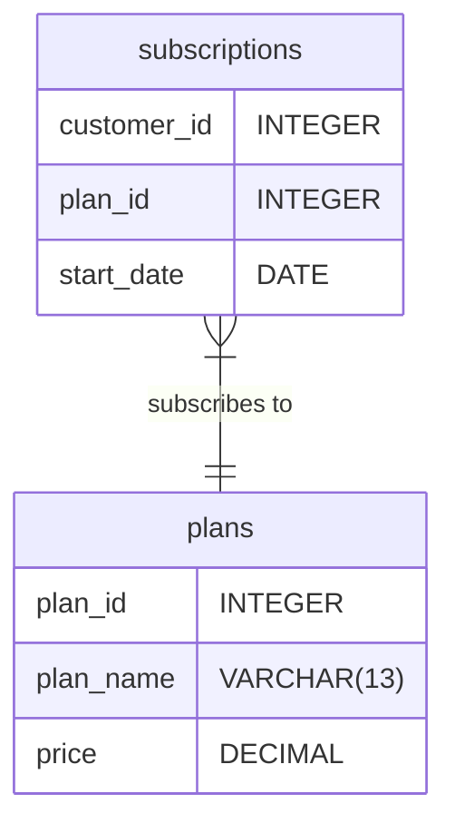

Case Study #1 - Danny's Diner
==================================================

<br>
<p align="center">
    
</p>
<p align="center">
    <i>
        <b>NOTE:</b> All information for this case study can be found 
        on the <a href="https://8weeksqlchallenge.com/case-study-3/">8-Week SQL Challenge</a> 
        by <a href="https://www.linkedin.com/in/datawithdanny/">Danny Ma</a>.
    </i>
</p>
<br>


Table of Contents
--------------------------------------------------

- [Introduction and Problem Statement](#introduction-and-problem-statement)
- [Available Data](#available-data)
- [Entity-Relationship Diagram](#entity-relationship-diagram)
- [Case Study Questions and Answers](#case-study-questions-and-answers)
    - [A. Customer Journey](#a-customer-journey)
    - [B. Data Analysis Questions](#b-data-analysis-questions)

<br>


Introduction and Problem Statement
--------------------------------------------------

Subscription-based services are booming, but Danny saw an untapped opportunity in the market&mdash;an entire streaming platform dedicated to food. Imagine Netflix, but exclusively for food lovers, with a library of cooking shows, recipe tutorials, and culinary adventures. Inspired by this vision, Danny gathered a team of talented friends, and in 2020, they launched Foodie-Fi: a unique streaming service offering unlimited access to food-focused content from across the globe through monthly and annual subscriptions.

Built on a data-driven foundation, Danny designed Foodie-Fi to make every major decision—from new features to investment strategies—guided by analytics. This case study dives into how Foodie-Fi uses subscription data to answer pivotal business questions and drive sustainable growth.

<br>


Available Data
--------------------------------------------------

Danny has shared 2 key tables of the `foodie_fi` database schema for you to explore:

- `plans`
- `subscriptions`

For more information and example of the data, please check out the link [here](https://8weeksqlchallenge.com/case-study-3/)

<br>


Entity-Relationship Diagram
--------------------------------------------------

Based on the data above, the entity-relationship diagram for Foodie-Fi can be drawn as follows:




<br>


Case Study Questions and Answers
--------------------------------------------------

### A. Customer Journey

Based off the 8 sample customers provided in the sample from the subscriptions table, write a brief description about each customer’s onboarding journey. Try to keep it as short as possible. You may also want to run some sort of join to make your explanations a bit easier!

| customer_id | plan_id | start_date |
|-------------|---------|------------|
| 1           | 0       | 2020-08-01 |
| 1           | 1       | 2020-08-08 |
| 2           | 0       | 2020-09-20 |
| 2           | 3       | 2020-09-27 |
| 11          | 0       | 2020-11-19 |
| 11          | 4       | 2020-11-26 |
| 13          | 0       | 2020-12-15 |
| 13          | 1       | 2020-12-22 |
| 13          | 2       | 2021-03-29 |
| 15          | 0       | 2020-03-17 |
| 15          | 2       | 2020-03-24 |
| 15          | 4       | 2020-04-29 |
| 16          | 0       | 2020-05-31 |
| 16          | 1       | 2020-06-07 |
| 16          | 3       | 2020-10-21 |
| 18          | 0       | 2020-07-06 |
| 18          | 2       | 2020-07-13 |
| 19          | 0       | 2020-06-22 |
| 19          | 2       | 2020-06-29 |
| 19          | 3       | 2020-08-29 |


#### Answer:

To add a plan name on the sample customer journey, we can join the `plans` table to the `subscriptions` table and then add the `plan_name` column to the query. Tihs will allow us to see the plan name for each customer clearly. 

| customer_id | plan_id | plan_name     | start_date |
|-------------|---------|---------------|------------|
| 1           | 0       | trial         | 2020-08-01 |
| 1           | 1       | basic monthly | 2020-08-08 |
| 2           | 0       | trial         | 2020-09-20 |
| 2           | 3       | pro annual    | 2020-09-27 |
| 11          | 0       | trial         | 2020-11-19 |
| 11          | 4       | churn         | 2020-11-26 |
| 13          | 0       | trial         | 2020-12-15 |
| 13          | 1       | basic monthly | 2020-12-22 |
| 13          | 2       | pro monthly   | 2021-03-29 |
| 15          | 0       | trial         | 2020-03-17 |
| 15          | 2       | pro monthly   | 2020-03-24 |
| 15          | 4       | churn         | 2020-04-29 |
| 16          | 0       | trial         | 2020-05-31 |
| 16          | 1       | basic monthly | 2020-06-07 |
| 16          | 3       | pro annual    | 2020-10-21 |
| 18          | 0       | trial         | 2020-07-06 |
| 18          | 2       | pro monthly   | 2020-07-13 |
| 19          | 0       | trial         | 2020-06-22 |
| 19          | 2       | pro monthly   | 2020-06-29 |
| 19          | 3       | pro annual    | 2020-08-29 |

As shown in the output above, most customers who began with a free trial eventually upgraded to a paid plan, including customers 1, 2, 13, 15, 16, 18, and 19. These customers initially used a 7-day free trial before transitioning to a basic or pro monthly plan. Additionally, three of these customers&mdash;number 2, number 16, and number 19&mdash;further upgraded to an annual pro plan.

However, only two customers, 11 and 15, churned. Customer 11 started with a free trial and then churned without upgrading. Customer 15 initially upgraded from a free trial to a pro monthly plan but churned after one month.


### B. Data Analysis Questions

#### 1. How many customers has Foodie-Fi ever had?

``` sql
SELECT COUNT(DISTINCT customer_id) AS unique_customer_count
FROM foodie_fi.subscriptions;
```

| unique_customer_count |
|-----------------------|
| 1000                  |


#### 2. What is the monthly distribution of `trial` plan `start_date` values for our dataset? Use the start of the month as the group by value.

``` sql
SELECT 
	EXTRACT(month FROM start_date) AS month_number,
	TO_CHAR(start_date, 'Month') AS month_name,
	COUNT(customer_id) AS trial_count
FROM foodie_fi.subscriptions
WHERE plan_id = 0
GROUP BY 
	month_number, 
	month_name
ORDER BY month_number;
```

| month_number | month_name | trial_count |
|--------------|------------|-------------|
| 1            | January    | 88          |
| 2            | February   | 68          |
| 3            | March      | 94          |
| 4            | April      | 81          |
| 5            | May        | 88          |
| 6            | June       | 79          |
| 7            | July       | 89          |
| 8            | August     | 88          |
| 9            | September  | 87          |
| 10           | October    | 79          |
| 11           | November   | 75          |
| 12           | December   | 84          |


####  3. What plan do `start_date` values occur after the year 2020 for our dataset? Show the breakdown by count of events for each `plan_name`.

``` sql
SELECT 
	plan_id, 
	plan_name, 
	COUNT(plan_id) AS event_count
FROM foodie_fi.subscriptions
INNER JOIN foodie_fi.plans USING(plan_id)
WHERE start_date >= '2021-01-01'
GROUP BY 
	plan_id, 
	plan_name
ORDER BY plan_id;
```

| plan_id |   plan_name   | event_count |
|---------|---------------|-------------|
|       1 | basic monthly |           8 |
|       2 | pro monthly   |          60 |
|       3 | pro annual    |          63 |
|       4 | churn         |          71 |


#### 4. What is the customer count and percentage of customers who have churned rounded to 1 decimal place?

``` sql
SELECT 
	plan_id, 
	plan_name,
	COUNT(DISTINCT customer_id) AS customer_count,
	ROUND( (COUNT(DISTINCT customer_id) * 100.0 ) / (
		SELECT COUNT(DISTINCT customer_id)
		FROM foodie_fi.subscriptions
	), 1) AS customer_percent
FROM foodie_fi.subscriptions
INNER JOIN foodie_fi.plans USING(plan_id)
WHERE plan_id = 4
GROUP BY 
	plan_id, 
	plan_name
ORDER BY plan_id;
```

| plan_id | plan_name | customer_count | customer_percent |
|---------|-----------|----------------|------------------|
| 4       | churn     | 307            | 30.7             |


#### 5. How many customers have churned straight after their initial free trial - what percentage is this rounded to the nearest whole number?

``` sql
WITH customer_plan_journey AS (
	SELECT 
		customer_id,
		plan_id,
		plan_name,
		start_date,
		ROW_NUMBER() OVER (PARTITION BY customer_id ORDER BY start_date) AS plan_selection
	FROM foodie_fi.subscriptions
	INNER JOIN foodie_fi.plans USING(plan_id)
)
SELECT 
	COUNT(customer_id) AS churn_count_after_trial,
	ROUND( (COUNT(DISTINCT customer_id) * 100.0 ) / (
		SELECT COUNT(DISTINCT customer_id)
		FROM foodie_fi.subscriptions
	), 0) AS churn_percent_after_trial
FROM customer_plan_journey
WHERE plan_id = 4 AND plan_selection = 2;
```

| churn_count_after_trial | churn_percent_after_trial |
|-------------------------|---------------------------|
| 92                      | 9                         |


#### 6. What is the number and percentage of customer plans after their initial free trial?

``` sql
WITH customer_plan_journey AS (
	SELECT 
		customer_id,
		plan_id,
		LEAD(plan_id) OVER (PARTITION BY customer_id ORDER BY start_date) AS next_plan
	FROM foodie_fi.subscriptions
)
SELECT 
	customer_plan_journey.next_plan AS plan_id, 
	p2.plan_name,
	COUNT(DISTINCT customer_plan_journey.customer_id) AS customer_count_after_trial,
	ROUND( (COUNT(DISTINCT customer_plan_journey.customer_id) * 100.0 ) / (
		SELECT COUNT(DISTINCT customer_id)
		FROM foodie_fi.subscriptions
	), 2) AS customer_percent_after_trial
FROM customer_plan_journey
INNER JOIN foodie_fi.plans AS p1 ON customer_plan_journey.plan_id = p1.plan_id
INNER JOIN foodie_fi.plans AS p2 ON customer_plan_journey.next_plan = p2.plan_id
WHERE customer_plan_journey.plan_id = 0
GROUP BY 1, 2;
```

| plan_id | plan_name     | customer_count_after_trial | customer_percent_after_trial |
|---------|---------------|----------------------------|------------------------------|
| 1       | basic monthly | 546                        | 54.60                        |
| 2       | pro monthly   | 325                        | 32.50                        |
| 3       | pro annual    | 37                         | 3.70                         |
| 4       | churn         | 92                         | 9.20                         |


#### 7. What is the customer count and percentage breakdown of all 5 `plan_name` values at `2020-12-31`?

``` sql
WITH customer_plan_journey AS (
	SELECT 
		customer_id,
		plan_id, 
		start_date AS current_plan,
		LEAD(start_date) OVER (PARTITION BY customer_id ORDER BY start_date) AS next_plan	
	FROM foodie_fi.subscriptions
	WHERE TO_CHAR(start_date, 'YYYY') = '2020'
)
SELECT 
	plan_id, 
	plan_name, 
	COUNT(DISTINCT customer_id) AS customer_count,
	ROUND( (COUNT(DISTINCT customer_id) * 100.0 ) / (
		SELECT COUNT(DISTINCT customer_id)
		FROM foodie_fi.subscriptions
	), 2) AS customer_percent
FROM customer_plan_journey
INNER JOIN foodie_fi.plans USING(plan_id)
WHERE next_plan IS NULL
GROUP BY plan_id, plan_name;
```

| plan_id | plan_name     | customer_count | customer_percent |
|---------|---------------|----------------|------------------|
| 0       | trial         | 19             | 1.90             |
| 1       | basic monthly | 224            | 22.40            |
| 2       | pro monthly   | 326            | 32.60            |
| 3       | pro annual    | 195            | 19.50            |
| 4       | churn         | 236            | 23.60            |


#### 8. How many customers have upgraded to an annual plan in 2020?

``` sql
SELECT COUNT(DISTINCT customer_id) AS annual_upgrade_count
FROM foodie_fi.subscriptions
WHERE TO_CHAR(start_date, 'YYYY') = '2020' AND plan_id = 3;
```

| annual_upgrade_count |
|----------------------|
| 195                  |


#### 9. How many days on average does it take for a customer to an annual plan from the day they join Foodie-Fi?

``` sql
WITH first_join_date AS (
	SELECT 
		customer_id, 
		MIN(start_date) AS start_date
	FROM foodie_fi.subscriptions
	GROUP BY customer_id
	ORDER BY customer_id
), first_join_plan AS (
	SELECT 
		customer_id,
		plan_id,
		plan_name AS start_plan_name, 
		start_date AS start_join_date
	FROM foodie_fi.subscriptions
	INNER JOIN first_join_date USING(customer_id, start_date)
	INNER JOIN foodie_fi.plans USING(plan_id)
	ORDER BY customer_id
), upgrade_pro_plan AS (
	SELECT 
		customer_id,
		plan_id, 
		plan_name AS pro_plan_name, 
		start_date AS start_pro_date
	FROM foodie_fi.subscriptions
	INNER JOIN foodie_fi.plans USING(plan_id)
	WHERE plan_id = 3
)
SELECT ROUND(AVG(start_pro_date - start_join_date), 2) AS avg_day_upgrade
FROM first_join_plan
INNER JOIN upgrade_pro_plan USING(customer_id);
```

| avg_day_upgrade |
|-----------------|
| 104.62          |


#### 10. Can you further breakdown this average value into 30 day periods (i.e. 0-30 days, 31-60 days etc)

``` sql
WITH first_join_date AS (
	SELECT 
		customer_id, 
		MIN(start_date) AS start_date
	FROM foodie_fi.subscriptions
	GROUP BY customer_id
	ORDER BY customer_id
), first_join_plan AS (
	SELECT 
		customer_id,
		plan_id,
		plan_name AS start_plan_name, 
		start_date AS start_join_date
	FROM foodie_fi.subscriptions
	INNER JOIN first_join_date USING(customer_id, start_date)
	INNER JOIN foodie_fi.plans USING(plan_id)
	ORDER BY customer_id
), upgrade_pro_plan AS (
	SELECT 
		customer_id,
		plan_id, 
		plan_name AS pro_plan_name, 
		start_date AS start_pro_date
	FROM foodie_fi.subscriptions
	INNER JOIN foodie_fi.plans USING(plan_id)
	WHERE plan_id = 3
), period_breakdown AS (
	SELECT 
		customer_id, 
		WIDTH_BUCKET(start_pro_date - start_join_date, 0, 365, 12) AS bucket,
		start_pro_date - start_join_date AS avg_day_upgrade
	FROM first_join_plan
	INNER JOIN upgrade_pro_plan USING(customer_id)
	ORDER BY customer_id
)
SELECT 
	bucket,
	(bucket - 1) * 30 || ' - ' || bucket * 30 || ' days' AS day_period, 
	COUNT(avg_day_upgrade) AS customer_count
FROM period_breakdown
GROUP BY bucket
ORDER BY bucket;
```

| bucket | day_period     | customer_count |
|--------|----------------|----------------|
| 1      | 0 - 30 days    | 49             |
| 2      | 30 - 60 days   | 24             |
| 3      | 60 - 90 days   | 35             |
| 4      | 90 - 120 days  | 35             |
| 5      | 120 - 150 days | 43             |
| 6      | 150 - 180 days | 37             |
| 7      | 180 - 210 days | 24             |
| 8      | 210 - 240 days | 4              |
| 9      | 240 - 270 days | 4              |
| 10     | 270 - 300 days | 1              |
| 11     | 300 - 330 days | 1              |
| 12     | 330 - 360 days | 1              |


#### 11. How many customers downgraded from a pro monthly to a basic monthly plan in 2020?

``` sql
WITH customer_plan_journey AS (
	SELECT 
		customer_id,
		start_date, 
		plan_id AS current_plan,
		LEAD(plan_id) OVER (PARTITION BY customer_id ORDER BY start_date) AS next_plan
	FROM foodie_fi.subscriptions
	INNER JOIN foodie_fi.plans USING(plan_id)
)
SELECT COUNT(customer_id) AS customer_count
FROM customer_plan_journey
WHERE 
	TO_CHAR(start_date, 'YYYY') = '2020' AND
	current_plan = 2 AND 
	next_plan = 1;
```

| customer_count |
|----------------|
| 0              |
